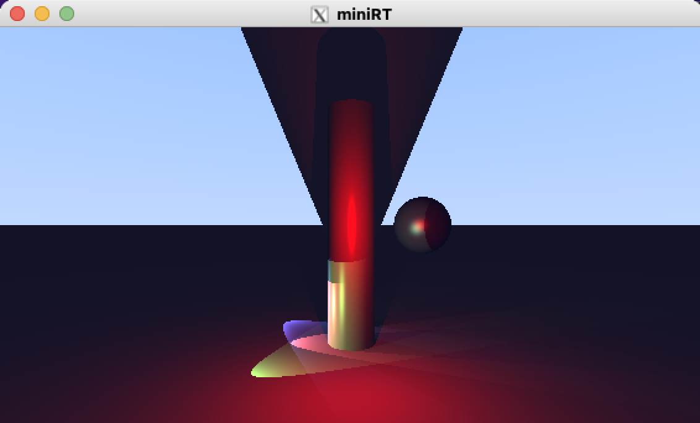
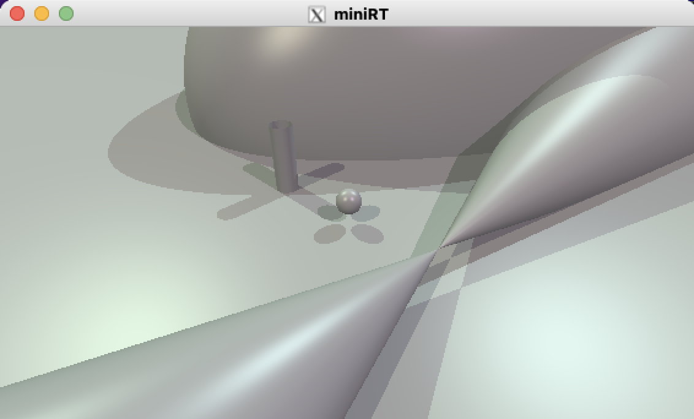
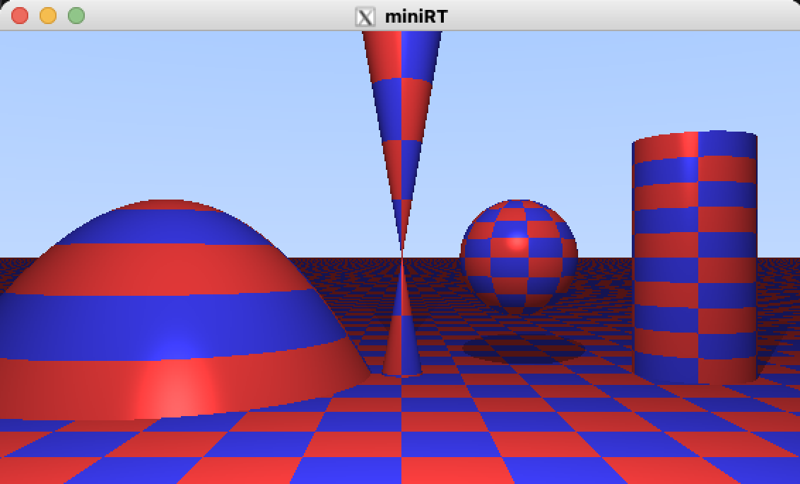
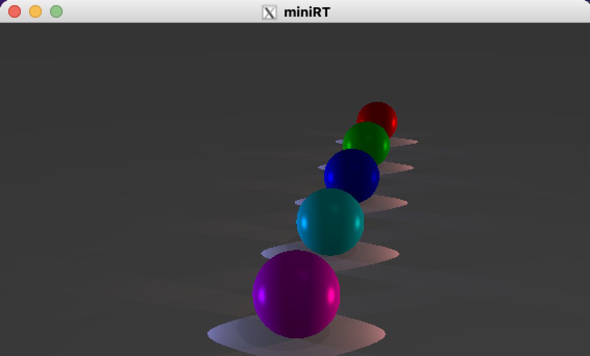

# miniRT

## Description
A Raytracer written in C and MiniLibX.

## Requirement

- gcc or Clang
- GNU Make

## Usage
```
git clone https://github.com/ryo-manba/miniRT
cd miniRT && make
```
An executable named miniRT will be created.
```
./miniRT [RTFILE_PATH]
```
## Samples

### Mix

(rtfiles/mix.rt)

### SunLight

(rtfiles_bonus/sunlight/all_objects.rt)

### CheckerBoard

(rtfiles_bonus/checkerboard/checker_board_all_objects.rt)

### SpotLights

(rtfiles_bonus/spotlight/spotlight_multiple.rt)
 
## Author

[corvvs](https://github.com/corvvs)<br>
[ryo-manba](https://twitter.com/ryo_manba)

## Licence

All code is released under the [MIT](https://github.com/ryo-manba/miniRT/blob/main/LICENSE) license
